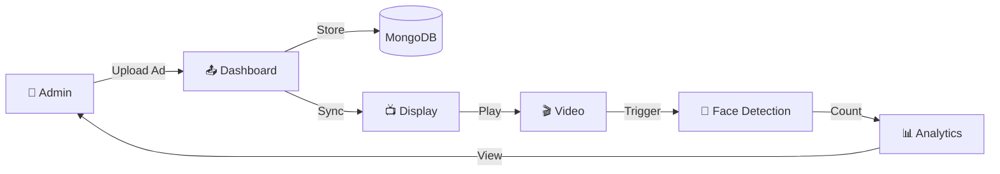

<div align="center">

# 🖥️ Digital Signage System

### 🚀 AI-Powered Smart Advertising & Viewer Analytics Platform

<p align="center">
  
  
  
  
  
</p>

<p align="center">
  <a href="#license"></a>
  <a href="#contributing"></a>
  
</p>

**A cutting-edge remote advertisement management and real-time viewer tracking system that empowers businesses to seamlessly manage ads across multiple locations from a single dashboard — powered by AI-based face detection for intelligent analytics.**

[📖 Documentation](#-getting-started) • [✨ Features](#-features) • [🛠️ Tech Stack](#️-tech-stack) • [👨‍💻 Author](#-author)

---

</div>

## 🎯 What is Digital Signage?

Digital Signage is a **full-stack solution** designed for modern advertising needs. It combines:

> 🎬 **Centralized Ad Management** — Control all your digital displays from one place  
> 🧠 **AI-Powered Analytics** — Real-time face detection to count and track viewers  
> 📊 **Performance Insights** — Detailed dashboards to measure ad effectiveness  
> 🌐 **Multi-Location Support** — Scale seamlessly across multiple screens and locations

---

## ✨ Features

<table>
<tr>
<td width="50%">

### 🎛️ Admin Dashboard
- ✅ **Secure user authentication** (Login/Register)
- ✅ **Upload & manage** video advertisements
- ✅ **Schedule ads** with start/end times
- ✅ **Assign ads** to specific locations

</td>
<td width="50%">

### 📺 Display System
- ✅ **Auto-sync** with central server
- ✅ **Seamless video playback** loop
- ✅ **Fullscreen** immersive experience
- ✅ **Automatic** video download & cleanup

</td>
</tr>
<tr>
<td width="50%">

### 🧠 AI & Computer Vision
- ✅ **Real-time face detection** (MTCNN)
- ✅ **Unique viewer counting** algorithm
- ✅ **Live camera feed** processing
- ✅ **OpenCV-powered** analysis engine

</td>
<td width="50%">

### 📊 Analytics & Reports
- ✅ **View count** per advertisement
- ✅ **Location-wise** performance data
- ✅ **Time-based** engagement analytics
- ✅ **Exportable** viewer statistics

</td>
</tr>
</table>

---

## 🛠️ Tech Stack

<div align="center">

| Layer | Technologies |
|:---:|:---|
| **🎨 Frontend** | HTML5, CSS3, EJS Templates, JavaScript |
| **⚙️ Backend** | Node.js, Express.js, Python, Flask |
| **🗄️ Database** | MongoDB, JSON Data Storage |
| **🤖 AI/ML** | OpenCV, MTCNN (Face Detection) |
| **🔐 Auth** | Express Sessions, Bcrypt |
| **📦 Other** | Multer, Axios, Moment.js, CORS |

</div>

---

## 🏗️ Architecture Overview

```text
┌─────────────────────────────────────────────────────────────────┐
│                        ADMIN DASHBOARD                          │
│                     (Client-Side Server)                        │
│              localhost:3000 • Node.js + Express                 │
├─────────────────────────────────────────────────────────────────┤
│  📝 Login/Register  │  📤 Upload Ads  │  📊 View Analytics      │
└──────────────┬──────────────────────────────────────────────────┘
               │ API Calls
               ▼
┌─────────────────────────────────────────────────────────────────┐
│                      DISPLAY SERVER                             │
│                    (Server-Side Server)                         │
│              localhost:4000 • Node.js + Express                 │
├─────────────────────────────────────────────────────────────────┤
│  🎬 Video Streaming  │  📥 Auto-Sync  │  🗂️ File Management    │
└──────────────┬──────────────────────────────────────────────────┘
               │ Triggers
               ▼
┌─────────────────────────────────────────────────────────────────┐
│                    FACE DETECTION ENGINE                        │
│                         Python + OpenCV                         │
├─────────────────────────────────────────────────────────────────┤
│  👁️ MTCNN Detection  │  🔢 Viewer Count  │  📈 Data Logging    │
└─────────────────────────────────────────────────────────────────┘
```

---

## 📁 Project Structure

The repository is organized into three distinct modules:

| Directory | Description | Key Components |
| :--- | :--- | :--- |
| 🖥️ `client-side/` | Admin Dashboard (Port 3000) | `server.js`, `views/`, `uploads/` |
| 📺 `server-side/` | Display Server & Analytics (Port 4000) | `server.js`, `countPeople.py` |
| 🎬 `videos/` | Centralized Media Storage | Uploaded `.mp4` ad files |

<br/>

### 🌳 Detailed Hierarchy

```text
📦 digital-signage
 ┣ 📂 client-side               # Admin Dashboard Server
 ┃ ┣ 📂 public                  # Assets & Views
 ┃ ┃ ┣ 📂 uploads               # Uploaded video files
 ┃ ┃ ┣ 📂 views                 # EJS Templates
 ┃ ┃ ┃ ┣ 📜 dashboard.ejs       # Admin Dashboard
 ┃ ┃ ┃ ┣ 📜 analysis.ejs        # Analytics views
 ┃ ┃ ┃ ┣ 📜 upload.ejs          # Upload ad views
 ┃ ┃ ┃ ┣ 📜 login.ejs           # Authentication
 ┃ ┃ ┃ ┗ 📜 register.ejs
 ┃ ┃ ┣ 📜 style.css             # Global styles
 ┃ ┃ ┣ 📜 logo.svg              # App Logo
 ┃ ┃ ┗ 📜 videoData.json        # Ad metadata storage
 ┃ ┣ 📜 server.js               # Express server (Port 3000)
 ┃ ┗ 📜 package.json            # Node dependencies
 ┣ 📂 server-side               # Display & Detection Server
 ┃ ┣ 📂 public                  # Display interface
 ┃ ┃ ┣ 📜 index.html            # Signage Viewer Display
 ┃ ┃ ┗ 📜 script.js             # Player & Sync logic
 ┃ ┣ 📂 videos                  # Local sync storage
 ┃ ┣ 📜 server.js               # Express server (Port 4000)
 ┃ ┣ 📜 countPeople.py          # MTCNN Face detection model
 ┃ ┣ 📜 start.py                # Auto-launcher script
 ┃ ┣ 📜 viewerData.json         # Real-time viewer count stats
 ┃ ┗ 📜 package.json            # Node dependencies
 ┗ 📂 videos                    # Main repository video storage
```

---

## 🚀 Getting Started

### 📋 Prerequisites

Before you begin, ensure you have the following installed:

| Requirement | Version | Download |
|:---:|:---:|:---:|
| Node.js | v16+ | [nodejs.org](https://nodejs.org/) |
| Python | 3.8+ | [python.org](https://python.org/) |
| MongoDB | Latest | [mongodb.com](https://mongodb.com/) |

---

### 1️⃣ Clone the Repository

```bash
git clone https://github.com/Sahil-2005/digital-signage.git
cd digital-signage
```

---

### 2️⃣ Install Dependencies

<details>
<summary><b>📦 Client-Side (Admin Dashboard)</b></summary>

```bash
cd client-side
npm install
```

**Dependencies installed:**
- `express` - Web framework
- `mongoose` - MongoDB ODM
- `bcrypt` - Password hashing
- `multer` - File uploads
- `ejs` - Template engine

</details>

<details>
<summary><b>📦 Server-Side (Display Server)</b></summary>

```bash
cd server-side
npm install
```

**Dependencies installed:**
- `express` - Web framework
- `axios` - HTTP client
- `moment` - Date handling
- `cors` - Cross-origin requests

</details>

<details>
<summary><b>🐍 Python Dependencies</b></summary>

```bash
pip install opencv-python mtcnn tensorflow
```

**Packages installed:**
- `opencv-python` - Computer vision
- `mtcnn` - Face detection model
- `tensorflow` - ML backend

</details>

---

### 3️⃣ Run the Application

> **Important:** Make sure MongoDB is running before starting the servers!

**Step 1: Start MongoDB**
```bash
mongod
```

**Step 2: Start Admin Dashboard (Client-Side)**
```bash
cd client-side
node server.js
```
🌐 Dashboard available at: `http://localhost:3000`

**Step 3: Start Display Server (Server-Side)**
```bash
cd server-side
node server.js
```
📺 Display available at: `http://localhost:4000`

**Step 4: Start Face Detection (Optional)**
```bash
cd server-side
python countPeople.py
```

---

## 📊 How It Works



| Step | Action | Description |
|:---:|:---:|:---|
| 1️⃣ | **Upload** | Admin uploads video ads via dashboard |
| 2️⃣ | **Store** | Metadata saved to MongoDB, files to uploads/ |
| 3️⃣ | **Sync** | Display servers fetch new ads automatically |
| 4️⃣ | **Play** | Videos play in loop on display screens |
| 5️⃣ | **Detect** | Camera detects faces watching the screen |
| 6️⃣ | **Analyze** | View counts aggregated per ad and location |

---

## 🔮 Future Roadmap

<div align="center">

| Status | Feature | Description |
|:---:|:---|:---|
| 🔄 | **Real-time Dashboard** | Live viewer count updates |
| 📱 | **Mobile App** | Admin app for iOS/Android |
| 📈 | **Advanced Analytics** | Chart.js/D3.js visualizations |
| 👥 | **Role-Based Access** | Admin, Manager, Viewer roles |
| 🎵 | **Playlist Scheduling** | Time-based ad rotation |
| ☁️ | **Cloud Deployment** | AWS/Azure hosting support |
| 🔔 | **Push Notifications** | Alerts for low engagement |

</div>

---

## 🤝 Contributing

We welcome contributions! Here's how you can help:

```bash
# 1. Fork the repository
# 2. Create your feature branch
git checkout -b feature/AmazingFeature

# 3. Commit your changes
git commit -m '✨ Add some AmazingFeature'

# 4. Push to the branch
git push origin feature/AmazingFeature

# 5. Open a Pull Request
```

---

## 👨‍💻 Author

<div align="center">


### **Sahil Gawade**

*Crafting modern, intelligent, and scalable solutions.*

<br/>

[](https://sahil-gawade.vercel.app/)
[](https://www.linkedin.com/in/sahil-gawade-920a0a242/)
[](https://github.com/Sahil-2005)
[](https://leetcode.com/u/sahilgawade4321/)
[](mailto:gawadesahil.dev@gmail.com)

</div>

---

## 📜 License

<div align="center">

This project is licensed under the **MIT License**

[](https://opensource.org/licenses/MIT)

*Feel free to use, modify, and distribute this project!*

</div>

---

<div align="center">

### ⭐ Star this repo if you found it helpful!


**Made with ❤️ by [Sahil Gawade](https://github.com/Sahil-2005)**

*📧 Have questions? Feel free to open an issue or reach out!*

</div>